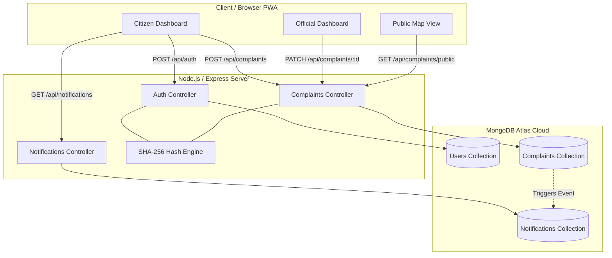
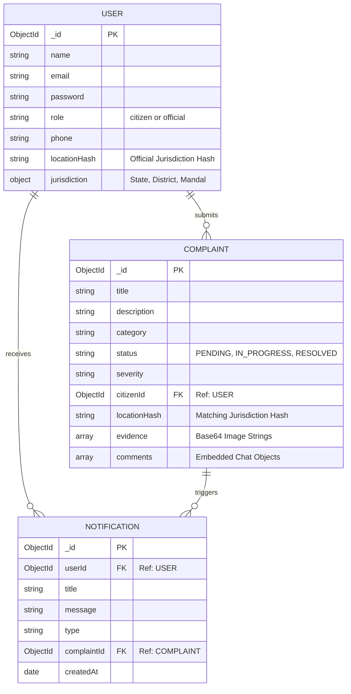

# Smart Grievance Tracker - System Documentation

Below are the detailed architectural diagrams, system designs, and database entity relationships for the Smart Grievance project, automatically generated using Mermaid diagrams.

## 1. High-Level System Architecture

This diagram illustrates the flow of data between the Client side (Progressive Web App), the Backend Node.js Server, and the Cloud Database.

---

## 2. Entity-Relationship (E-R) Diagram

This represents how the MongoDB NoSQL schemas are structured. Notice that the chat system (`comments`) is embedded directly inside the `COMPLAINT` document for speed, while `NOTIFICATIONS` act as a separate linkage collection.

---

## 3. Cryptographic Hash-Based Routing Workflow

This sequence diagram explains the exact chronological flow of how a complaint is generated by a citizen and mathematically lands on the correct Official's dashboard without manual assignment.

```mermaid
sequenceDiagram
    autonumber
    participant C as Citizen
    participant API as Node.js Backend
    participant DB as MongoDB
    participant O as Official

    C->>API: Submits Grievance (State, District, Village)
    
    rect rgb(20, 50, 90)
    Note over API: Location string is stripped of whitespace & lowercased
    Note over API: SHA-256 Hash is generated
    end

    API->>DB: Save Complaint w/ unique `locationHash`
    
    O->>API: Official Requests Dashboard Data
    API->>DB: Fetch Official's Account
    DB-->>API: Returns Official's `locationHash`
    
    rect rgb(20, 50, 90)
    Note over API: Engine looks for exact mathematical match
    end
    
    API->>DB: Fetch Complaints WHERE hash == Official.locationHash
    DB-->>API: Returns exactly matched geographic Complaints
    API-->>O: Renders Complaints on Official UI
```

